# Comparative Benchmark (Disk-Backed): Nova vs Oxigraph vs QLever vs Fluree

Dataset: 50,000 synthetic BSBM-style entities (1,250,000 triples), identical N-Triples file loaded into all 5 engines. RDFox is mem-only in this harness and is not included on disk.

## Methodology & Storage Model

This is the **disk-backed/persistent-storage** sibling of `RESULTS_MEM.md` (the pure in-memory comparison). All engines were benchmarked over the SPARQL 1.1 HTTP Protocol using **byte-identical SPARQL query text** against a **byte-identical dataset**. Each query was run with a warm-up pass (discarded) before N timed iterations.

**Storage model per engine** (this matters — see below):

| Engine | Storage model | Notes |
|---|---|---|
| **Nova (louds)** | `LoudsStore::open(dir)` — WAL-backed | Every `insert()` is durably logged (fsync-per-write) to a write-ahead log before being applied in memory; periodic `compact()` merges the delta into an on-disk snapshot. CSV id: `nova-louds`. |
| **Nova (ring)** | `RingStore::open(dir)` — WAL-backed | Same product surface as LOUDS: `--location` WAL + snapshot via `nova_serve --backend ring`. CSV id: `nova-ring`. |
| **Oxigraph** | `serve --location <dir>` — RocksDB-backed | Oxigraph's own default/production persistent storage mode (`oxrocksdb-sys`). |
| **QLever** | Memory-mapped disk index (mmap) | Unchanged from the in-memory comparison — QLever has no other mode. A warm-up pass ensures the OS page cache holds the working set resident before timed measurements. |
| **Fluree** | `fluree/server --storage-path` (host volume) | File-backed persistent ledger. SPARQL is connection-scoped; the harness injects `FROM <ledger>` into each query. |
| **RDFox** | N/A (In-memory only) | RDFox is not disk-backed and thus excluded from this benchmark. |

**Memory usage** is reported as *physical footprint* for Nova/QLever (macOS `vmmap -summary <pid>`'s `Physical footprint:` line — falls back to `ps -o rss` on platforms without `vmmap`) and container memory for Oxigraph/Fluree (`docker stats`). See `README.md` for the full rationale behind this choice over raw `ps -o rss`.

**On-disk footprint** is measured via `du -sk` on each engine's data directory after the query phase completes (includes WAL + snapshot files for Nova (louds/ring), the full RocksDB directory for Oxigraph, all QLever index/permutation files, and Fluree storage-path contents).

**CPU usage** is sampled every ~0.3s throughout each engine's query phase and averaged. Values are percent of one CPU core.

**Process isolation (Nova backends).** Nova (louds) and Nova (ring) are launched as **independent fresh processes** and measured in **separate phases** (start → load → warm-up → timed queries → resource sample → kill), not selected by flipping a backend flag inside one long-running process.

## Dataset Load Time

Wall-clock time to load the identical N-Triples dataset and become ready to serve queries. For Nova (louds/ring) this is parse + `bulk_load()` into a WAL-backed `--location` store (crash-safe snapshot commit) — necessarily different from the pure in-memory path in `RESULTS_MEM.md`. For Oxigraph this is the HTTP bulk-load POST into the RocksDB-backed store. For QLever this is the same `qlever-index` build step as the in-memory comparison (QLever's index is always disk-based). For Fluree this is create-ledger + N-Triples insert into `--storage-path`.

| Engine | Load time |
|---|---|
| Nova (louds) | 2.16 s |
| Nova (ring) | 2.17 s |
| Oxigraph | 13.13 s |
| QLever | 3.21 s |
| Fluree | 5.44 s |

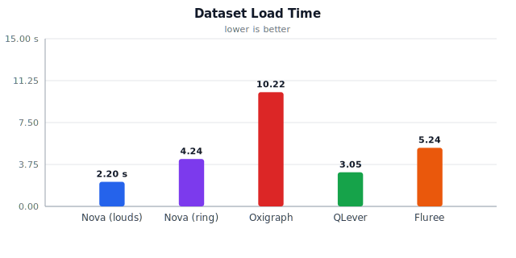

## Memory Usage (Physical Footprint)

| Engine | Memory | Storage model |
|---|---|---|
| Nova (louds) | 88.4 MiB | WAL-backed heap (recovered/compacted state resident) |
| Nova (ring) | 81.5 MiB | WAL-backed heap (recovered/compacted state resident) |
| Oxigraph | 597.4MiB | RocksDB-backed (block cache + heap) |
| QLever | 84.5 MiB | Incl. memory-mapped index pages |
| Fluree | 7.268GiB | Container memory (file-backed ledger) |

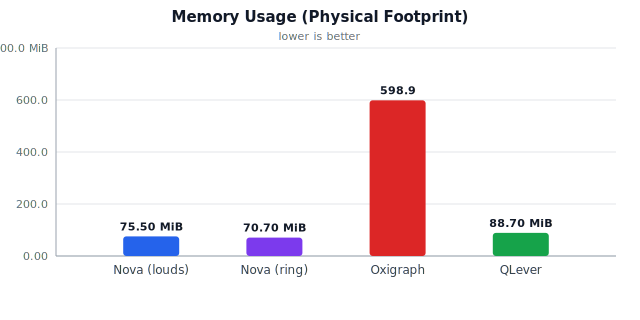

## On-Disk Footprint

`du -sk` on each engine's data directory after the query phase (WAL + snapshot for both Nova backends, full RocksDB dir for Oxigraph, all index/permutation files for QLever, Fluree storage-path for Fluree).

| Engine | On-disk size |
|---|---|
| Nova (louds) | 18.9 MiB |
| Nova (ring) | 6.3 MiB |
| Oxigraph | 416.5 MiB |
| QLever | 4.2 MiB |
| Fluree | 10.8 MiB |

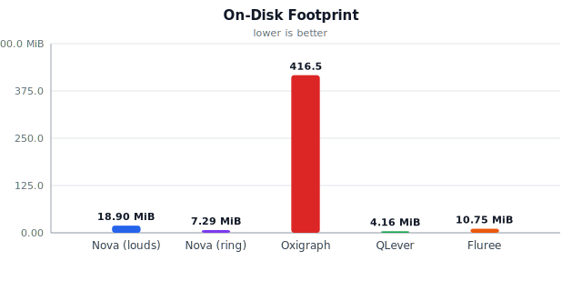

## CPU Usage (average % of one core during query phase)

| Engine | Avg CPU % |
|---|---|
| Nova (louds) | 47.6% |
| Nova (ring) | 63.2% |
| Oxigraph | 97.3% |
| QLever | 55.6% |
| Fluree | 89.9% |

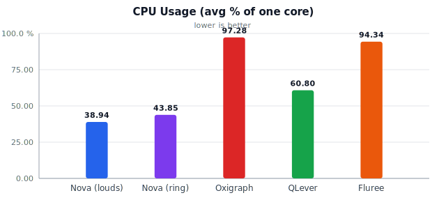

## Latency Results (milliseconds, HTTP round-trip via curl)

One sub-section per query, with each engine as a column and each percentile (p50, p95) as a row. Charts use p50 latency (lower is better).

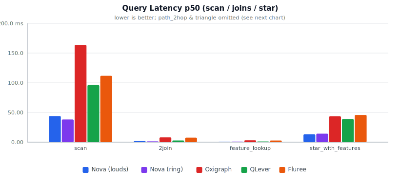

### scan

| Metric | Nova (louds) | Nova (ring) | Oxigraph | QLever | Fluree |
|---|---|---|---|---|---|
| p50 (ms) | 53.55 | 51.36 | 190.67 | 95.31 | 119.30 |
| p95 (ms) | 54.28 | 73.31 | 198.94 | 104.84 | 128.00 |

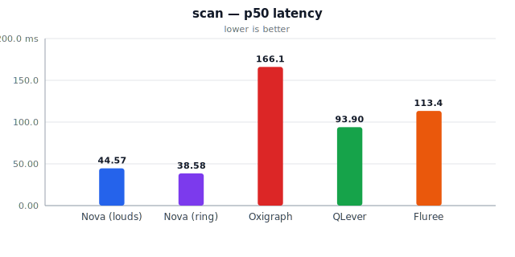

### 2join

| Metric | Nova (louds) | Nova (ring) | Oxigraph | QLever | Fluree |
|---|---|---|---|---|---|
| p50 (ms) | 1.94 | 1.88 | 8.89 | 2.69 | 8.03 |
| p95 (ms) | 2.06 | 2.68 | 9.29 | 3.11 | 8.68 |

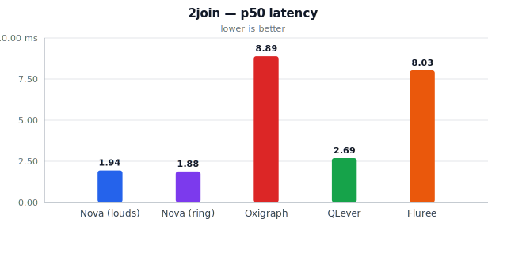

### feature_lookup

| Metric | Nova (louds) | Nova (ring) | Oxigraph | QLever | Fluree |
|---|---|---|---|---|---|
| p50 (ms) | 0.82 | 1.04 | 3.29 | 1.19 | 2.84 |
| p95 (ms) | 0.91 | 1.15 | 3.65 | 1.28 | 4.56 |

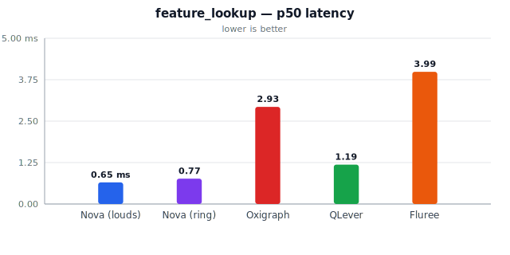

### star_with_features

| Metric | Nova (louds) | Nova (ring) | Oxigraph | QLever | Fluree |
|---|---|---|---|---|---|
| p50 (ms) | 16.67 | 20.96 | 47.14 | 39.00 | 50.33 |
| p95 (ms) | 17.44 | 21.41 | 48.21 | 39.86 | 56.94 |

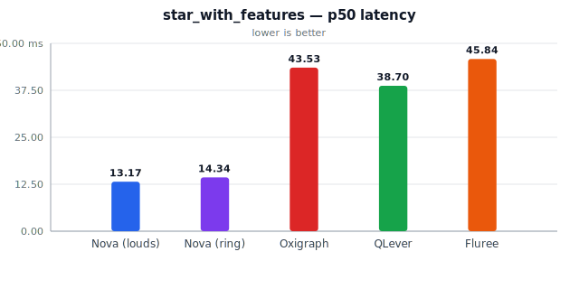

### path_2hop

| Metric | Nova (louds) | Nova (ring) | Oxigraph | QLever | Fluree |
|---|---|---|---|---|---|
| p50 (ms) | 528.24 | 641.72 | 2046.51 | 1281.38 | 1393.50 |
| p95 (ms) | 535.83 | 662.26 | 2068.26 | 1320.26 | 2020.77 |

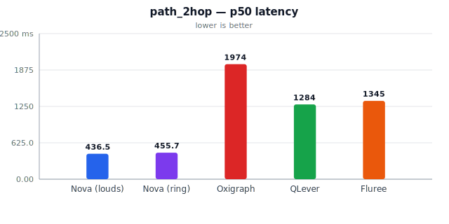

### triangle

| Metric | Nova (louds) | Nova (ring) | Oxigraph | QLever | Fluree |
|---|---|---|---|---|---|
| p50 (ms) | 247.50 | 358.01 | 1914.56 | 435.45 | 650.43 |
| p95 (ms) | 252.82 | 366.38 | 2009.26 | 447.31 | 700.30 |

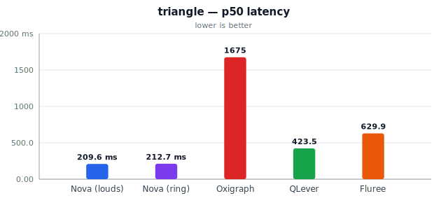

## Raw per-query summary (mean, stddev, n)

One sub-section per query, with each engine as a column and each statistic (n, mean, stddev, min, max) as a row.

### scan

| Metric | Nova (louds) | Nova (ring) | Oxigraph | QLever | Fluree |
|---|---|---|---|---|---|
| n | 10 | 10 | 10 | 10 | 10 |
| mean (ms) | 53.69 | 55.65 | 191.72 | 96.90 | 119.65 |
| stddev (ms) | 0.44 | 9.88 | 5.55 | 4.45 | 5.32 |
| min (ms) | 53.18 | 47.34 | 182.79 | 94.05 | 114.35 |
| max (ms) | 54.34 | 76.91 | 200.31 | 108.52 | 132.91 |

### 2join

| Metric | Nova (louds) | Nova (ring) | Oxigraph | QLever | Fluree |
|---|---|---|---|---|---|
| n | 10 | 10 | 10 | 10 | 10 |
| mean (ms) | 1.93 | 1.98 | 8.95 | 2.78 | 8.14 |
| stddev (ms) | 0.10 | 0.47 | 0.24 | 0.20 | 0.33 |
| min (ms) | 1.80 | 1.68 | 8.55 | 2.60 | 7.79 |
| max (ms) | 2.11 | 3.29 | 9.30 | 3.21 | 8.83 |

### feature_lookup

| Metric | Nova (louds) | Nova (ring) | Oxigraph | QLever | Fluree |
|---|---|---|---|---|---|
| n | 10 | 10 | 10 | 10 | 10 |
| mean (ms) | 0.82 | 1.05 | 3.30 | 1.18 | 3.12 |
| stddev (ms) | 0.06 | 0.07 | 0.29 | 0.08 | 0.78 |
| min (ms) | 0.74 | 0.97 | 2.66 | 1.05 | 2.52 |
| max (ms) | 0.93 | 1.17 | 3.71 | 1.28 | 4.78 |

### star_with_features

| Metric | Nova (louds) | Nova (ring) | Oxigraph | QLever | Fluree |
|---|---|---|---|---|---|
| n | 10 | 10 | 10 | 10 | 10 |
| mean (ms) | 16.76 | 21.02 | 46.87 | 39.09 | 51.33 |
| stddev (ms) | 0.41 | 0.22 | 1.17 | 0.48 | 3.46 |
| min (ms) | 16.21 | 20.79 | 44.86 | 38.51 | 48.59 |
| max (ms) | 17.60 | 21.57 | 48.65 | 40.18 | 60.27 |

### path_2hop

| Metric | Nova (louds) | Nova (ring) | Oxigraph | QLever | Fluree |
|---|---|---|---|---|---|
| n | 10 | 10 | 10 | 10 | 10 |
| mean (ms) | 528.79 | 643.78 | 2037.10 | 1287.95 | 1519.97 |
| stddev (ms) | 4.68 | 11.29 | 29.03 | 19.74 | 294.55 |
| min (ms) | 522.72 | 633.21 | 1983.37 | 1270.19 | 1334.18 |
| max (ms) | 538.65 | 671.81 | 2072.00 | 1334.98 | 2284.73 |

### triangle

| Metric | Nova (louds) | Nova (ring) | Oxigraph | QLever | Fluree |
|---|---|---|---|---|---|
| n | 10 | 10 | 10 | 10 | 10 |
| mean (ms) | 248.14 | 358.73 | 1916.25 | 437.39 | 657.24 |
| stddev (ms) | 2.98 | 5.15 | 60.21 | 6.38 | 25.78 |
| min (ms) | 244.75 | 352.16 | 1840.22 | 431.33 | 636.24 |
| max (ms) | 255.14 | 367.73 | 2058.09 | 454.76 | 721.53 |

