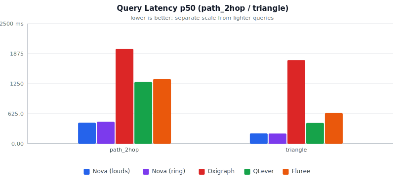

# Comparative Benchmark (Disk-Backed): Nova vs Oxigraph vs QLever vs Fluree

Dataset: 50,000 synthetic BSBM-style entities (1,250,000 triples), identical N-Triples file loaded into all 5 engines. RDFox is mem-only in this harness and is not included on disk.

## Methodology & Storage Model

This is the **disk-backed/persistent-storage** sibling of `RESULTS_MEM.md` (the pure in-memory comparison). All engines were benchmarked over the SPARQL 1.1 HTTP Protocol using **byte-identical SPARQL query text** against a **byte-identical dataset**. Each query was run with a warm-up pass (discarded) before N timed iterations.

**Storage model per engine** (this matters — see below):

| Engine | Storage model | Notes |
|---|---|---|
| **Nova (louds)** | `LoudsStore::open(dir)` — WAL-backed | Every `insert()` is durably logged (fsync-per-write) to a write-ahead log before being applied in memory; periodic `compact()` merges the delta into an on-disk snapshot. CSV id: `nova-louds`. |
| **Nova (ring)** | `RingStore::open(dir)` — WAL-backed | Same product surface as LOUDS: `--location` WAL + snapshot via `nova_serve --backend ring`. CSV id: `nova-ring`. |
| **Oxigraph** | `serve --location <dir>` — RocksDB-backed | Oxigraph's own default/production persistent storage mode (`oxrocksdb-sys`). |
| **QLever** | Memory-mapped disk index (mmap) | Unchanged from the in-memory comparison — QLever has no other mode. A warm-up pass ensures the OS page cache holds the working set resident before timed measurements. |
| **Fluree** | `fluree/server --storage-path` (host volume) | File-backed persistent ledger. Memory footprint is **dynamic (not measured)**: LeafletCache/import budgets are host-relative and not comparable to pure-heap engines. SPARQL is connection-scoped; the harness injects `FROM <ledger>` into each query. |
| **RDFox** | N/A (In-memory only) | RDFox is not disk-backed and thus excluded from this benchmark. |

**Memory usage** is reported as *physical footprint* for Nova/QLever (macOS `vmmap -summary <pid>`'s `Physical footprint:` line — falls back to `ps -o rss` on platforms without `vmmap`) and container memory for Oxigraph/Fluree (`docker stats`). See `README.md` for the full rationale behind this choice over raw `ps -o rss`.

**On-disk footprint** is measured via `du -sk` on each engine's data directory after the query phase completes (includes WAL + snapshot files for Nova (louds), WAL + snapshot files for Nova (ring), the full RocksDB directory for Oxigraph, all QLever index/permutation files, and Fluree storage-path contents).

**CPU usage** is sampled every ~0.3s throughout each engine's query phase and averaged. Values are percent of one CPU core.

**Process isolation (Nova backends).** Nova (louds) and Nova (ring) are launched as **independent fresh processes** and measured in **separate phases** (start → load → warm-up → timed queries → resource sample → kill), not selected by flipping a backend flag inside one long-running process.

## Dataset Load Time

Wall-clock time to load the identical N-Triples dataset and become ready to serve queries. For Nova (louds) this includes WAL-logging every triple (fsync-per-write) plus a `compact()` pass — necessarily slower than the in-memory `bulk_load()` path measured in `RESULTS_MEM.md`. For Nova (ring) this is parse + `bulk_load()` into a WAL-backed `--location` store (same crash-safe snapshot commit path as LOUDS). For Oxigraph this is the HTTP bulk-load POST into the RocksDB-backed store. For QLever this is the same `qlever-index` build step as the in-memory comparison (QLever's index is always disk-based). For Fluree this is create-ledger + N-Triples insert into `--storage-path`.

| Engine | Load time |
|---|---|
| Nova (louds) | 2.20 s |
| Nova (ring) | 4.24 s |
| Oxigraph | 10.22 s |
| QLever | 3.05 s |
| Fluree | 5.24 s |

## Memory Usage (Physical Footprint)

| Engine | Memory | Storage model |
|---|---|---|
| Nova (louds) | 75.4 MiB | WAL-backed heap (recovered/compacted state resident) |
| Nova (ring) | 71.2 MiB | WAL-backed heap (recovered/compacted state resident) |
| Oxigraph | 597.6MiB | RocksDB-backed (block cache + heap) |
| QLever | 90.6 MiB | Incl. memory-mapped index pages |
| Fluree | dynamic (not measured) | File-backed ledger; cache/import budgets host-relative |

## On-Disk Footprint

`du -sk` on each engine's data directory after the query phase (WAL + snapshot for both Nova backends, full RocksDB dir for Oxigraph, all index/permutation files for QLever, Fluree storage-path for Fluree).

| Engine | On-disk size |
|---|---|
| Nova (louds) | 18.9 MiB |
| Nova (ring) | 7.3 MiB |
| Oxigraph | 416.5 MiB |
| QLever | 4.2 MiB |
| Fluree | 10.8 MiB |

## CPU Usage (average % of one core during query phase)

| Engine | Avg CPU % |
|---|---|
| Nova (louds) | 42.0% |
| Nova (ring) | 44.0% |
| Oxigraph | 94.2% |
| QLever | 61.4% |
| Fluree | 94.3% |

## Latency Results (milliseconds, HTTP round-trip via curl)

One sub-section per query, with each engine as a column and each percentile (p50, p95) as a row. Charts use p50 latency (lower is better). `path_2hop` and `triangle` are charted separately — their latencies are orders of magnitude higher and would crush the scale of the other queries.

### scan

| Metric | Nova (louds) | Nova (ring) | Oxigraph | QLever | Fluree |
|---|---|---|---|---|---|
| p50 (ms) | 44.57 | 38.58 | 166.07 | 93.90 | 113.40 |
| p95 (ms) | 46.00 | 40.99 | 175.33 | 95.23 | 121.25 |

### 2join

| Metric | Nova (louds) | Nova (ring) | Oxigraph | QLever | Fluree |
|---|---|---|---|---|---|
| p50 (ms) | 1.40 | 1.33 | 9.92 | 2.60 | 7.76 |
| p95 (ms) | 1.46 | 1.37 | 13.15 | 2.78 | 8.96 |

### feature_lookup

| Metric | Nova (louds) | Nova (ring) | Oxigraph | QLever | Fluree |
|---|---|---|---|---|---|
| p50 (ms) | 0.65 | 0.77 | 2.93 | 1.19 | 3.99 |
| p95 (ms) | 0.78 | 0.86 | 3.53 | 1.29 | 4.65 |

### star_with_features

| Metric | Nova (louds) | Nova (ring) | Oxigraph | QLever | Fluree |
|---|---|---|---|---|---|
| p50 (ms) | 14.07 | 14.00 | 43.86 | 37.97 | 45.08 |
| p95 (ms) | 15.64 | 14.94 | 47.87 | 39.29 | 46.18 |

### path_2hop

| Metric | Nova (louds) | Nova (ring) | Oxigraph | QLever | Fluree |
|---|---|---|---|---|---|
| p50 (ms) | 435.06 | 450.32 | 1888.84 | 1262.90 | 1406.16 |
| p95 (ms) | 452.08 | 461.30 | 1959.89 | 1274.51 | 1816.37 |

### triangle

| Metric | Nova (louds) | Nova (ring) | Oxigraph | QLever | Fluree |
|---|---|---|---|---|---|
| p50 (ms) | 209.63 | 212.71 | 1674.75 | 423.53 | 629.94 |
| p95 (ms) | 214.60 | 215.51 | 1702.38 | 429.05 | 651.90 |

## Raw per-query summary (mean, stddev, n)

One sub-section per query, with each engine as a column and each statistic (n, mean, stddev, min, max) as a row.

### scan

| Metric | Nova (louds) | Nova (ring) | Oxigraph | QLever | Fluree |
|---|---|---|---|---|---|
| n | 10 | 10 | 10 | 10 | 10 |
| mean (ms) | 44.57 | 38.73 | 166.22 | 93.77 | 113.93 |
| stddev (ms) | 1.07 | 1.36 | 7.40 | 1.15 | 4.76 |
| min (ms) | 42.99 | 37.03 | 153.80 | 91.64 | 108.29 |
| max (ms) | 46.08 | 41.03 | 175.87 | 95.84 | 123.85 |

### 2join

| Metric | Nova (louds) | Nova (ring) | Oxigraph | QLever | Fluree |
|---|---|---|---|---|---|
| n | 10 | 10 | 10 | 10 | 10 |
| mean (ms) | 1.39 | 1.32 | 10.28 | 2.63 | 7.90 |
| stddev (ms) | 0.05 | 0.05 | 1.93 | 0.10 | 0.71 |
| min (ms) | 1.32 | 1.22 | 8.16 | 2.49 | 7.01 |
| max (ms) | 1.48 | 1.38 | 14.22 | 2.78 | 9.44 |

### feature_lookup

| Metric | Nova (louds) | Nova (ring) | Oxigraph | QLever | Fluree |
|---|---|---|---|---|---|
| n | 10 | 10 | 10 | 10 | 10 |
| mean (ms) | 0.67 | 0.78 | 2.89 | 1.19 | 4.06 |
| stddev (ms) | 0.07 | 0.06 | 0.44 | 0.07 | 0.47 |
| min (ms) | 0.56 | 0.72 | 2.29 | 1.09 | 3.22 |
| max (ms) | 0.79 | 0.87 | 3.76 | 1.31 | 4.67 |

### star_with_features

| Metric | Nova (louds) | Nova (ring) | Oxigraph | QLever | Fluree |
|---|---|---|---|---|---|
| n | 10 | 10 | 10 | 10 | 10 |
| mean (ms) | 14.03 | 14.12 | 44.24 | 38.19 | 45.15 |
| stddev (ms) | 1.10 | 0.52 | 2.18 | 0.62 | 0.68 |
| min (ms) | 12.82 | 13.60 | 41.72 | 37.57 | 44.18 |
| max (ms) | 16.31 | 15.30 | 48.16 | 39.55 | 46.38 |

### path_2hop

| Metric | Nova (louds) | Nova (ring) | Oxigraph | QLever | Fluree |
|---|---|---|---|---|---|
| n | 10 | 10 | 10 | 10 | 10 |
| mean (ms) | 438.24 | 451.50 | 1898.48 | 1264.73 | 1472.33 |
| stddev (ms) | 8.52 | 6.06 | 48.17 | 6.10 | 223.95 |
| min (ms) | 430.13 | 443.91 | 1836.12 | 1256.72 | 1335.24 |
| max (ms) | 456.02 | 463.16 | 1963.96 | 1275.05 | 2096.72 |

### triangle

| Metric | Nova (louds) | Nova (ring) | Oxigraph | QLever | Fluree |
|---|---|---|---|---|---|
| n | 10 | 10 | 10 | 10 | 10 |
| mean (ms) | 210.18 | 212.83 | 1674.80 | 423.89 | 634.69 |
| stddev (ms) | 2.99 | 2.20 | 19.43 | 3.58 | 11.57 |
| min (ms) | 205.58 | 209.14 | 1647.52 | 416.72 | 621.97 |
| max (ms) | 216.39 | 215.54 | 1705.01 | 430.93 | 652.22 |

