# Comparative Benchmark: Nova vs Oxigraph vs QLever vs Fluree vs RDFox

Dataset: 50,000 synthetic BSBM-style entities (1,250,000 triples), identical N-Triples file loaded into all 6 engines.

## Methodology & Storage Model

All 6 engines were benchmarked over the SPARQL 1.1 HTTP Protocol (`curl` to each engine's `/sparql` or query endpoint) using **byte-identical SPARQL query text** against a **byte-identical dataset**. Each query was run with a warm-up pass (discarded) before N timed iterations, so all reported latencies reflect steady-state (not cold-cache) performance.

**Storage model per engine** (this matters — see below):

| Engine | Storage model | Notes |
|---|---|---|
| **Nova (louds)** | Pure in-process heap (`LoudsStore`) | Default production in-memory backend; LOUDS + LFTJ index. |
| **Nova (ring)** | Pure in-process heap (`RingStore`) | Cyclic QWT ring backend (`--backend ring`); in-memory bulk_load (WAL available via `--location` on disk runs). |
| **Oxigraph** | Pure in-memory (`serve` run **without** `--location`) | Deliberately run in-memory (not its default RocksDB-backed mode) to match Nova's memory model. |
| **QLever** | Memory-mapped disk index (mmap) | QLever has **no pure in-memory mode**. After warm-up the OS page cache holds the working set resident — consistent with QLever's published methodology. |
| **Fluree** | Ephemeral container FS (`fluree/server`, no host volume) | Default file storage lives inside the container and is destroyed with it — functionally in-memory for this bench. Memory footprint is **dynamic (not measured)**: LeafletCache/import budgets are host-relative and not comparable to pure-heap engines. SPARQL is connection-scoped; the harness injects `FROM <ledger>` into each query (addressing only). |
| **RDFox** | In-memory datastore (sandbox/daemon, `parallel-nn`) | Optional comparator: licensed RDFox binary + `.lic` (auto-skipped when missing; `research/` is gitignored and not required). |

**Memory usage** is reported as *physical footprint* for Nova/QLever (macOS `vmmap -summary <pid>`'s `Physical footprint:` line — falls back to `ps -o rss` on platforms without `vmmap`, e.g. Linux) and container memory for Oxigraph (`docker stats`). `vmmap`'s physical footprint is used instead of raw `ps -o rss` because on macOS, `ps` RSS includes allocator-retained-but-freed memory (`libmalloc` keeps large freed regions mapped for fast reuse rather than returning them to the OS immediately) and was observed to vary by 10x+ (30-300+ MB) run-to-run for the *identical* process and workload with zero code changes. `vmmap`'s physical footprint is the same figure macOS's Activity Monitor and the kernel's own memory accounting report, and is stable across repeated runs. For QLever, this figure includes memory-mapped index pages resident via the OS page cache — architecturally different from Nova/Oxigraph's pure heap allocations, but it answers the same practical question ("how much RAM does this process hold to serve the workload"), so it is used as the common denominator across engines. This asymmetry is called out explicitly here rather than left implicit.

**CPU usage** is sampled every ~0.3s throughout each engine's query phase (`ps -o %cpu` for Nova/QLever; `docker stats --format '{{.CPUPerc}}'` for Oxigraph) and averaged. Values are percent of one CPU core (e.g. 150% means 1.5 cores kept busy on average) — this is a coarse approximation, not a precise profiler measurement, but useful for relative comparison.

**Process isolation (Nova backends).** Nova (louds) and Nova (ring) are launched as **independent fresh processes** and measured in **separate phases** (start → load → warm-up → timed queries → resource sample → kill), not selected by flipping a backend flag inside one long-running process. Each backend uses its own release binary (`nova_serve` default vs `nova_serve --backend ring` built with `--features ring-backend`). This keeps RSS/CPU samples attributable to a single backend and avoids cross-backend heap or page-cache contamination within the Nova process.

**Latency variability.** Primary latency comparisons use **medians (p50)** (with p95 for tail behavior). Within-process iteration stddev can be material — e.g. Ring `path_2hop` stddev around **66.47 ms** versus about **23.20 ms** for LOUDS on the same query shape — so means alone are easy to over-read. Future optimization runs should keep medians as the headline metric, use enough timed rounds after warm-up, and may add **process-level repetitions** (full restart → load → query phase) on top of within-process query iterations when comparing backends or tracking regressions.

## Dataset Load Time

Wall-clock time to load the identical N-Triples dataset and become ready to serve queries (includes parsing + index construction for all engines; for Nova this is parse + `compact()` into the LOUDS or Ring index, for QLever this is the separate `qlever-index` build step, for Oxigraph this is the HTTP bulk-load POST into the in-memory store).

| Engine | Load time |
|---|---|
| Nova (louds) | 2.18 s |
| Nova (ring) | 2.19 s |
| Oxigraph | 1.99 s |
| QLever | 3.18 s |
| Fluree | 5.00 s |
| RDFox | 1.26 s |

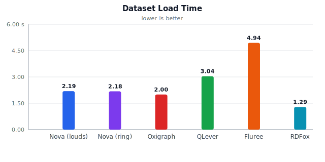

## Memory Usage (Physical Footprint)

Nova/QLever figures are macOS `vmmap -summary`'s "Physical footprint" (stable, allocator-retention-immune — see Methodology above); falls back to `ps -o rss` on non-macOS platforms.

| Engine | Memory | Storage model |
|---|---|---|
| Nova (louds) | 91.4 MiB | Pure heap (LOUDS) |
| Nova (ring) | 74.6 MiB | Pure heap (Ring) |
| Oxigraph | 338.2MiB | Pure heap (in-memory mode) |
| QLever | 86.7 MiB | Incl. memory-mapped index pages |
| Fluree | dynamic (not measured) | Ephemeral container FS; cache/import budgets host-relative |
| RDFox | 69.2 MiB | Pure heap (RDFox) |

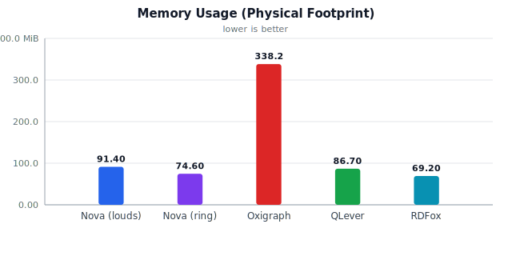

## CPU Usage (average % of one core during query phase)

| Engine | Avg CPU % |
|---|---|
| Nova (louds) | 40.6% |
| Nova (ring) | 43.5% |
| Oxigraph | 81.7% |
| QLever | 62.0% |
| Fluree | 93.7% |
| RDFox | 59.7% |

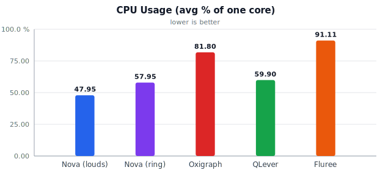

## Latency Results (milliseconds, HTTP round-trip via curl)

One sub-section per query, with each engine as a column and each percentile (p50, p95) as a row. Charts use p50 latency (lower is better). `path_2hop` and `triangle` are charted separately — their latencies are orders of magnitude higher and would crush the scale of the other queries.

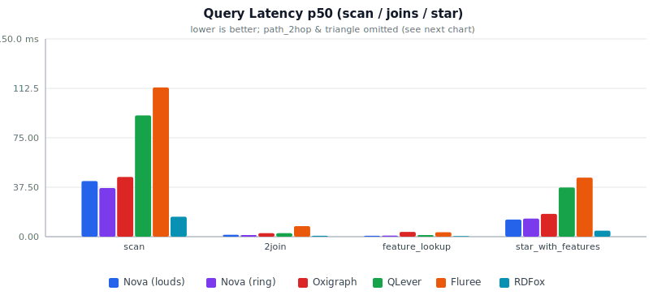

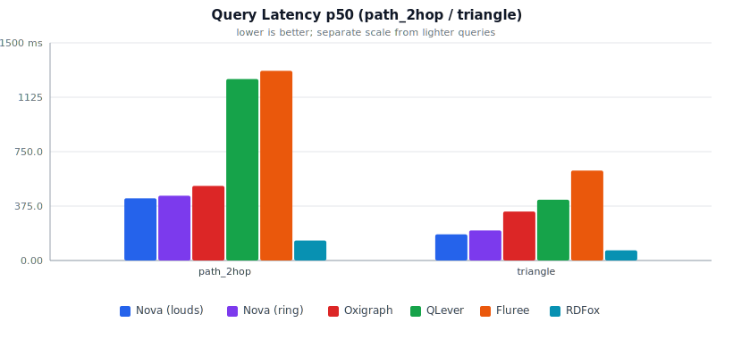

### scan

| Metric | Nova (louds) | Nova (ring) | Oxigraph | QLever | Fluree | RDFox |
|---|---|---|---|---|---|---|
| p50 (ms) | 44.53 | 39.11 | 45.13 | 94.03 | 114.05 | 17.90 |
| p95 (ms) | 45.00 | 41.53 | 50.77 | 96.14 | 120.78 | 18.99 |

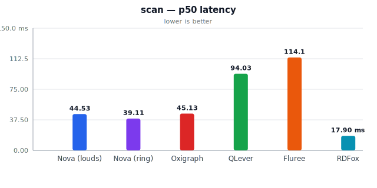

### 2join

| Metric | Nova (louds) | Nova (ring) | Oxigraph | QLever | Fluree | RDFox |
|---|---|---|---|---|---|---|
| p50 (ms) | 1.67 | 1.19 | 2.88 | 2.89 | 8.48 | 0.63 |
| p95 (ms) | 1.98 | 1.29 | 3.29 | 3.01 | 9.08 | 0.75 |

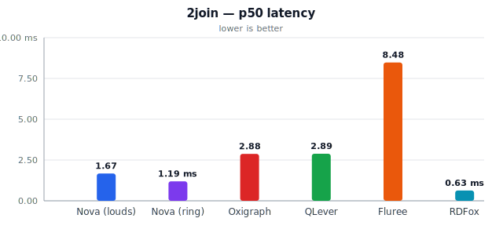

### feature_lookup

| Metric | Nova (louds) | Nova (ring) | Oxigraph | QLever | Fluree | RDFox |
|---|---|---|---|---|---|---|
| p50 (ms) | 0.72 | 0.76 | 2.92 | 1.16 | 5.71 | 0.31 |
| p95 (ms) | 1.00 | 0.82 | 4.03 | 1.33 | 7.58 | 0.43 |

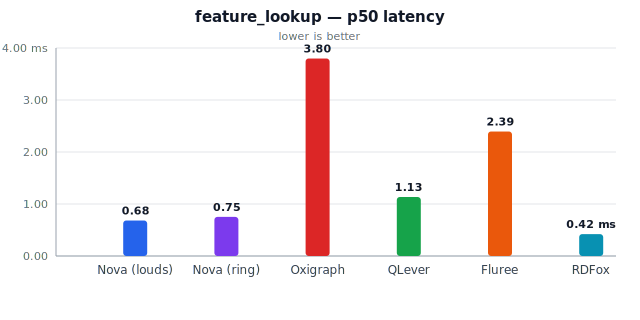

### star_with_features

| Metric | Nova (louds) | Nova (ring) | Oxigraph | QLever | Fluree | RDFox |
|---|---|---|---|---|---|---|
| p50 (ms) | 13.75 | 14.98 | 17.07 | 38.12 | 44.48 | 4.64 |
| p95 (ms) | 14.57 | 15.53 | 18.89 | 39.01 | 47.51 | 5.17 |

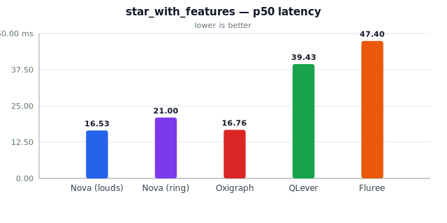

### path_2hop

| Metric | Nova (louds) | Nova (ring) | Oxigraph | QLever | Fluree | RDFox |
|---|---|---|---|---|---|---|
| p50 (ms) | 441.65 | 457.09 | 515.05 | 1268.27 | 1448.81 | 138.50 |
| p95 (ms) | 450.33 | 462.49 | 524.36 | 1279.49 | 1903.95 | 141.16 |

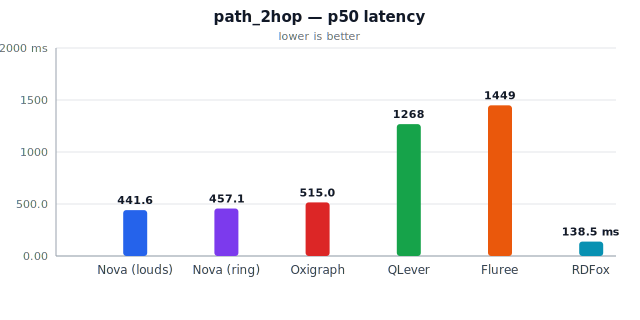

### triangle

| Metric | Nova (louds) | Nova (ring) | Oxigraph | QLever | Fluree | RDFox |
|---|---|---|---|---|---|---|
| p50 (ms) | 221.87 | 211.42 | 337.95 | 424.31 | 631.07 | 72.67 |
| p95 (ms) | 243.05 | 216.35 | 341.98 | 428.71 | 646.60 | 74.93 |

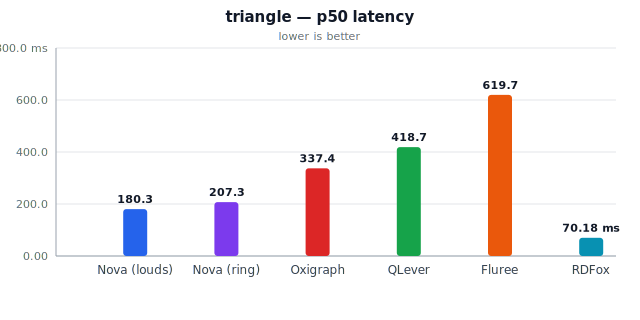

## Raw per-query summary (mean, stddev, n)

One sub-section per query, with each engine as a column and each statistic (n, mean, stddev, min, max) as a row.

### scan

| Metric | Nova (louds) | Nova (ring) | Oxigraph | QLever | Fluree | RDFox |
|---|---|---|---|---|---|---|
| n | 10 | 10 | 10 | 10 | 10 | 10 |
| mean (ms) | 44.52 | 39.41 | 46.21 | 94.18 | 114.20 | 17.68 |
| stddev (ms) | 0.34 | 1.63 | 2.72 | 1.23 | 4.51 | 1.22 |
| min (ms) | 43.91 | 37.13 | 44.00 | 92.76 | 107.75 | 14.83 |
| max (ms) | 45.19 | 41.62 | 53.00 | 96.79 | 122.88 | 19.19 |

### 2join

| Metric | Nova (louds) | Nova (ring) | Oxigraph | QLever | Fluree | RDFox |
|---|---|---|---|---|---|---|
| n | 10 | 10 | 10 | 10 | 10 | 10 |
| mean (ms) | 1.72 | 1.20 | 2.92 | 2.87 | 8.39 | 0.64 |
| stddev (ms) | 0.15 | 0.05 | 0.25 | 0.11 | 0.60 | 0.07 |
| min (ms) | 1.53 | 1.14 | 2.58 | 2.68 | 7.26 | 0.56 |
| max (ms) | 2.01 | 1.32 | 3.51 | 3.01 | 9.09 | 0.80 |

### feature_lookup

| Metric | Nova (louds) | Nova (ring) | Oxigraph | QLever | Fluree | RDFox |
|---|---|---|---|---|---|---|
| n | 10 | 10 | 10 | 10 | 10 | 10 |
| mean (ms) | 0.81 | 0.76 | 2.71 | 1.17 | 5.25 | 0.34 |
| stddev (ms) | 0.13 | 0.04 | 1.13 | 0.12 | 1.77 | 0.07 |
| min (ms) | 0.68 | 0.72 | 1.06 | 0.98 | 2.85 | 0.25 |
| max (ms) | 1.04 | 0.86 | 4.08 | 1.36 | 8.38 | 0.44 |

### star_with_features

| Metric | Nova (louds) | Nova (ring) | Oxigraph | QLever | Fluree | RDFox |
|---|---|---|---|---|---|---|
| n | 10 | 10 | 10 | 10 | 10 | 10 |
| mean (ms) | 13.82 | 14.98 | 17.39 | 38.21 | 44.88 | 4.71 |
| stddev (ms) | 0.55 | 0.36 | 0.94 | 0.49 | 1.59 | 0.29 |
| min (ms) | 13.16 | 14.53 | 16.71 | 37.71 | 43.33 | 4.40 |
| max (ms) | 14.59 | 15.61 | 19.89 | 39.03 | 49.07 | 5.31 |

### path_2hop

| Metric | Nova (louds) | Nova (ring) | Oxigraph | QLever | Fluree | RDFox |
|---|---|---|---|---|---|---|
| n | 10 | 10 | 10 | 10 | 10 | 10 |
| mean (ms) | 442.40 | 456.99 | 515.07 | 1269.65 | 1507.67 | 138.55 |
| stddev (ms) | 5.52 | 3.91 | 6.67 | 6.08 | 243.96 | 1.87 |
| min (ms) | 435.85 | 452.25 | 502.00 | 1261.44 | 1302.04 | 135.49 |
| max (ms) | 450.91 | 462.75 | 525.12 | 1284.37 | 2160.17 | 142.16 |

### triangle

| Metric | Nova (louds) | Nova (ring) | Oxigraph | QLever | Fluree | RDFox |
|---|---|---|---|---|---|---|
| n | 10 | 10 | 10 | 10 | 10 | 10 |
| mean (ms) | 224.52 | 212.35 | 338.02 | 423.96 | 633.47 | 71.93 |
| stddev (ms) | 11.03 | 2.74 | 3.26 | 3.66 | 8.51 | 2.24 |
| min (ms) | 216.62 | 209.54 | 332.80 | 417.47 | 627.15 | 68.78 |
| max (ms) | 254.29 | 216.38 | 342.25 | 429.21 | 656.22 | 75.93 |

